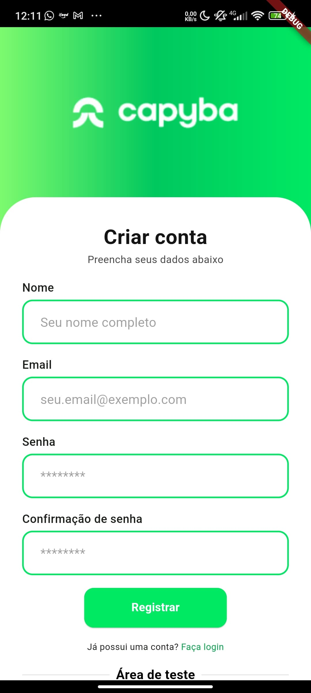
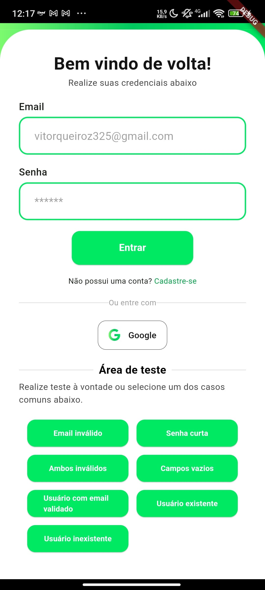
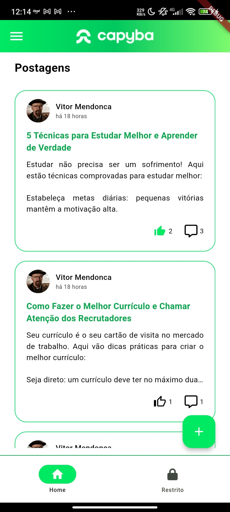
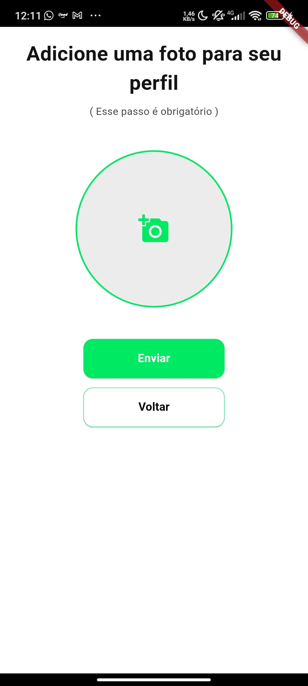
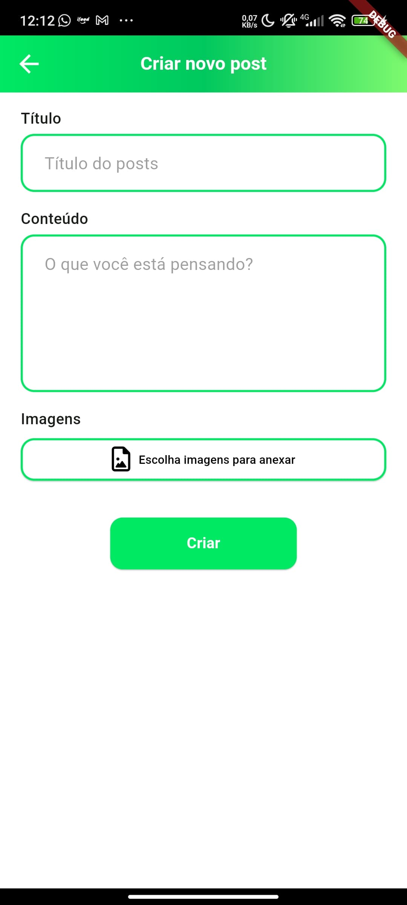

# Flutter Firebase - Capyba Challenge

<div style="display: flex; gap: 10px;">


</div>

## Descrição
Aplicativo desenvolvido em Flutter utilizando Firebase como backend, seguindo a arquitetura BLoC Pattern para gerenciamento de estado. O app permite interação social através de posts, comentários e likes.

## Pré-requisitos
- Flutter SDK: 3.19.3
- Firebase Core: ^2.24.2
- Dart SDK: '>=3.2.3 <4.0.0'
- Git

## Pacotes Utilizados
  - flutter_bloc: ^9.1.0
  - firebase_core: ^3.13.0
  - firebase_auth: ^5.5.2
  - google_sign_in: ^6.2.2
  - get: ^4.7.2
  - image_picker: ^1.1.2
  - permission_handler: ^12.0.0+1
  - font_awesome_flutter: ^10.8.0
  - cloud_firestore: ^5.6.6
  - json_annotation: ^4.9.0
  - timeago: ^3.7.0
  - shimmer: ^3.0.0
  - photo_view: ^0.15.0
  - path: ^1.9.0
  - flutter_dotenv: ^5.2.1

## Inicialização do Projeto

1. Clone o repositório:
```bash
git clone https://github.com/VitorMendonca62/flutter_firebase.git
```

2. Configure o Firebase:
```bash
flutter pub add firebase_core
flutterfire configure
```

3. Adicione seu arquivo `google-services.json` em:
```
android/app/google-services.json
```

4. Instale as dependências:
```bash
flutter pub get
```

5. Execute o projeto:
```bash
flutter run
```

## Estrutura do Projeto
```
lib/
lib/
├── models/
│   ├── comment/
│   ├── post/
├── screens/
│   ├── galery_page.dart
│   ├── auth/
│   │   ├── blocs/
│   │   └── pages/
│   ├── post/
│   ├── posts/
│   └── profile/
├── utils/
├── widgets/
├── colors.dart
├── constants.dart
├── firebase_options.dart
├── main.dart
├── routes.dart
├── guards/
```

## Funcionalidades

### Autenticação
- Login com email/senha
- Login com Google
- Registro de usuários

### Posts
- Criação de posts com imagens
- Deletar post
- Editar post
- Feed de posts
- Feed de posts restristos
- Likes e comentários

### Perfil
- Edição de perfil
- Visualização de perfil
- Validação de email
- Alteração de senha

## Padrão BLoC
O projeto utiliza o BLoC Pattern para:
- Gerenciamento de estado
- Separação de responsabilidades
- Fluxo de dados unidirecional

## Como Contribuir
1. Faça um Fork
2. Crie sua branch (`git checkout -b feature/NovaFeature`)
3. Commit suas mudanças (`git commit -m 'Adiciona nova feature'`)
4. Push para a branch (`git push origin feature/NovaFeature`)
5. Abra um Pull Request

## Screenshots
<div style="display: flex; flex-wrap: wrap; gap: 10px;">

### Telas do Aplicativo








</div>
